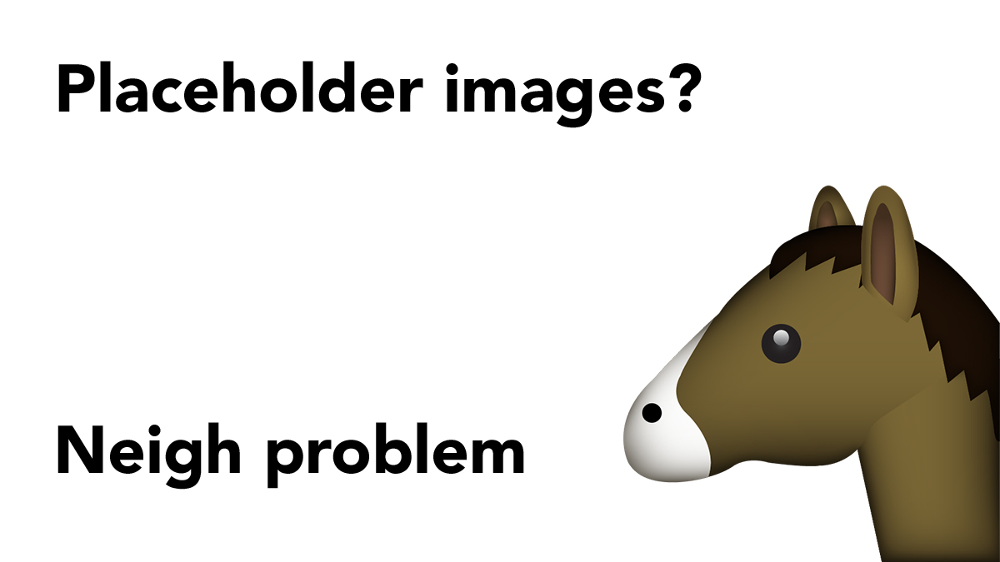

# HorseHead.me
*This wasn't even done for a bet*

## How to use this *completely hilarious* service
Simply paste a link in this format, wherever you need human(s) wearing an uncomfortable latex horse head mask:

`https://horsehead.me/[width]/[height]*/[options]*` 
(* optional)

If you don't specify a height, you'll get a **square** human(s) wearing an uncomfortable latex horse head mask. 

## Available [options]
* Grayscale: `g`

## Some examples
* Any Keanu: [https://horsehead.me/200/150](https://horsehead.me/200/150)
* Square + Grayscale: [https://horsehead.me/250/g](https://horsehead.me/250/g)

If you, for instance, need a little more Keanu in your website projects, you can include him with an \:

``

## How does it work?
When you send a valid request to this website, a random photo of [Keanu Reeves](https://en.wikipedia.org/wiki/Keanu_Reeves) is displayed.

The photos are cached on your end for 1 day, which is why you don't get a new Keanu on every page load.

While some placeholder image websites dynamically create new images, this service is SVG-based. For this to work properly, all photos have been encoded to Base64.

## Contributing
If you found a bug that needs fixing, or have a feature you want to discuss or implement, feel free to open an issue or a pull request. Any contribution is appreciated, big or small!

## License
All images of human(s) wearing an uncomfortable latex horse head mask belong to their respective owners. See the full [human(s) wearing an uncomfortable latex horse head mask list](https://horsehead.me/uncomfortable-humans) for photo attributions.

Redistributed under the MIT License. Check out the original and _whoah_ cooler [PlaceKeanu.com](https://placekeanu.com) by [Alexander Sandberg](https://github.com/alexandersandberg)

---

Thanks for checking out my project! _Now you're hot-to-trot_.